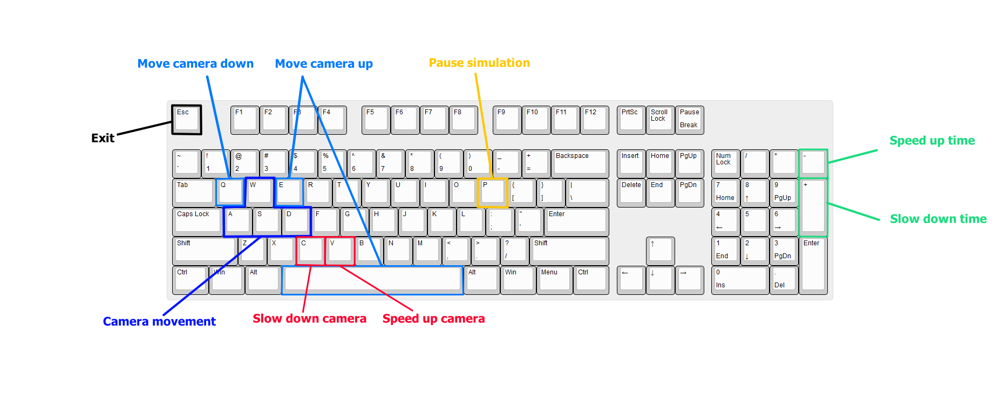

# Solar System
Welcome to the Solar System Simulation! This project is a 3D simulation of the solar system using C++ and OpenGL.

## Features
- Accurate (relative to earth) representation of the day/night cycles of the planets in the solar system.
- Free fly camera for exploring the solar system.
- Ability to control the flow of time, stop it and even reverse it.
- Wireframe view mode.
- A plethora of tweakable settings to customize the experience.

## Controls

## The settings
Various options and preferences can be specified in the `settings.h` file.
Such as : 
- Key bindings.
- Planet positions, speeds, rotations and sizes.
- Lighting color and intensity.
- Time speeds.
- Camera speed and mouse sensitivity.
- Window and viewport settings.

## The simulation
The simulated solar system contains the Sun, Mercury, Venus, Earth, Mars, Jupiter, Saturn, Uranus and Neptune.

## Shaders and lighting

Various shaders are used to achieve different lighting effects on the planets, here is a brief overview :

The earth uses the most advanced shader, using a mix of 4 textures to correctly render clouds, specular lighting on water, and a day/night city lights cycle.

The shader used to render the rest of the planets only takes into account the diffused light and the ambient light.

The sun and the skybox are rendered using a very simple shader with no lighting applied.

## Dependencies
- C++17
- OpenGL 3.3 (or later)
- [GLFW](https://github.com/glfw/glfw) 3.3 (or later)
- [GLM](https://github.com/Dav1dde/glad)
  
All of the dependencies are already included in the repository and are statically linked with the Visual Studio project.

## Building and Running

- Open the project in Visual Studio by double clicking on the `Solar System.sln` solution file.
- Simply compile and run the project, all of the dependencies should already be statically linked.

Tested with Visual Studio 2019 version 16.11.16, other versions of Visual Studio should work too.

## Credits
Planet textures were retrieved from https://www.solarsystemscope.com/textures/

An OpenGL resource that greatly helped : https://learnopengl.com/
